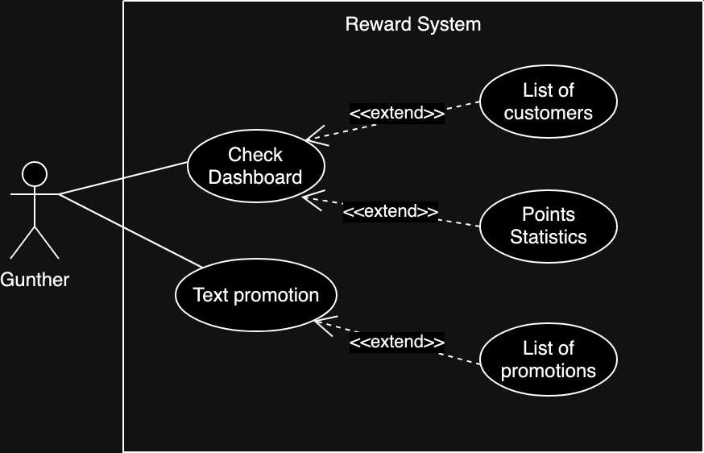
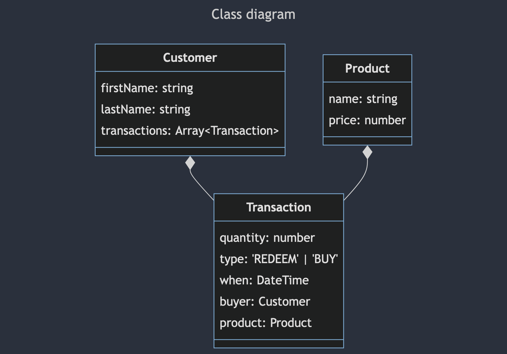
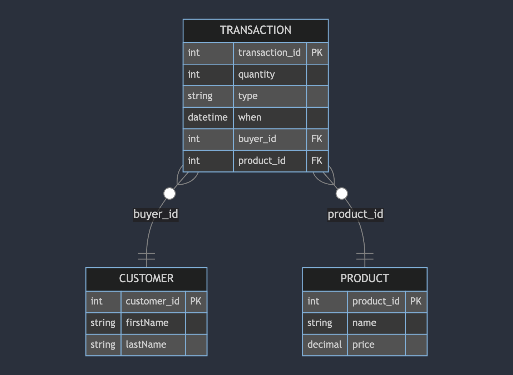
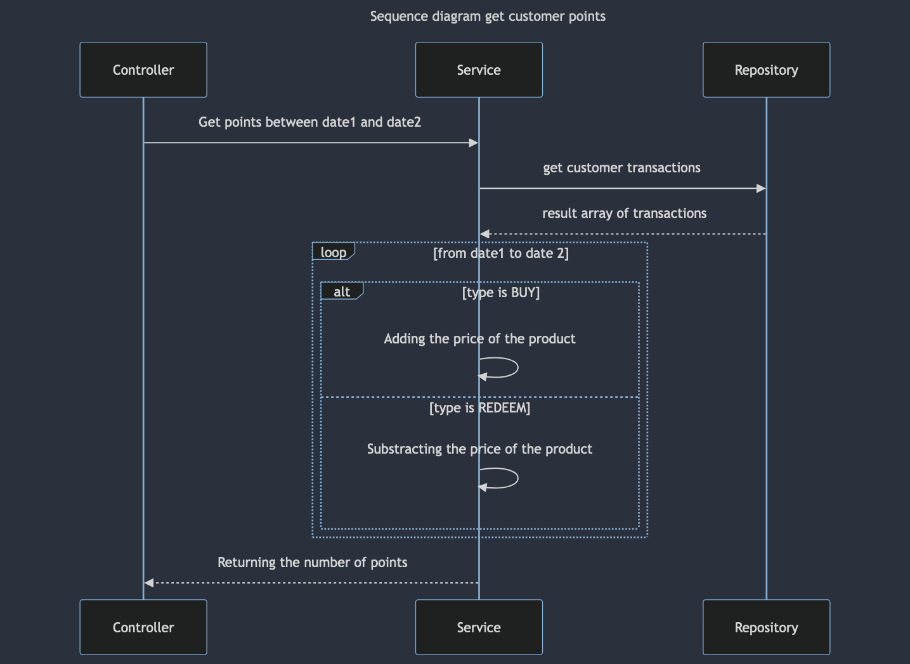
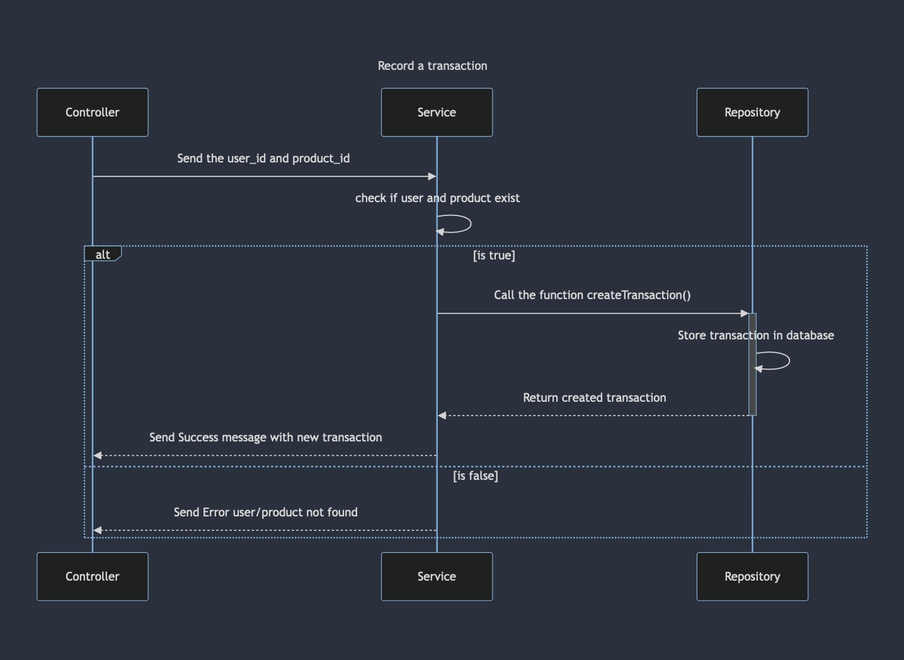

## Introduction

This project is a reward system app built with React, Tailwind CSS, and Vite. It includes state management using Redux Toolkit, Material UI components, and routing with React Router.

## Table of Contents

- [Architecture and Design](#architecture-and-design)
  - [Api endpoints](#api-endpoints)
  - [Router and Layout](#router-and-layout)
- [Diagrams](#diagrams)
  - [Use case diagram](#use-case-diagram)
  - [Class diagram](#class-diagram)
  - [Sequence diagram (Get Customer points)](#sequence-diagram-get-points)
- [How To Run](#how-to-run)

## Architecture and Design

### Api endpoints
Using a class with static fields simplifies and abstracts calling them.
```ts
// src/ApiRoutes.ts
class ApiRoutes {
  static customers = {
    async getAll(): Promise<() => User[]> {
      return await fetch(`${getAPI_URL()}/users`).then((res) => res.json());
    },
  };
}

// Would be called like this
await ApiRoutes.customers.getAll();
```

### Router and Layout
Making a layout as a functional component that takes as prop the "slot" or the component to load depending on the page.

Simplifing the addition of new routes
```ts
// src/routes.tsx
const slotElements: slotElement[] = [
  { path: "/", slot: Dashboard },
  { path: "/promotion", slot: Promotion },
  // { path: "/example", slot: Example } Adding a new route
];

const routes: RouteObject[] = slotElements.map((slotElt) => ({
  path: slotElt.path,
  element: <Layout LayoutSlot={slotElt.slot} />,
}));
```

## Diagrams

### Use case diagram


### Class diagram


### Data model diagram


### Sequence diagram (Get points)


### Sequence diagram (Record a transaction)



## How to run

First, ensure you have the necessary tools installed on your machine:

- [Node.js](https://nodejs.org/en/download/) (version 14.x or higher)
- [Yarn](https://classic.yarnpkg.com/en/docs/install) (version 1.x)

Clone the repository and install the dependencies:

```bash
git clone https://github.com/YeGoRenji/use-case-assignement.git
cd use-case-assignement
yarn
```

Run in dev

```bash
yarn dev
```

Build it

```bash
yarn build
```

